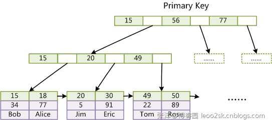

## 索引的本质
MySQL官方对索引的定义为：索引（Index）是帮助MySQL高效获取数据的数据结构。目前大部分数据库系统及文件系统都采用B-Tree或其变种B+Tree作为索引结构

**B 树**: 平衡树

**B- 树**: 多路搜索树（并不是二叉的）

   1. 非叶子结点最多只有M个儿子，且M>2；
   2. 根结点的儿子数为[2, M]；
   3. 除根结点以外的非叶子结点的儿子数最少M/2（向上取整）；
   4. 所有叶子结点位于同一层；
   5. 每个结点存放至少M/2-1（向上取整）和至多M-1个关键字；（如下图根节点中25,50,75）
   6. 非叶子结点的关键字：K[1], K[2], …, K[M-1]；且K[i] < K[i+1]；（如下图根节点中25,50,75）
   7. 非叶子结点的指针：P[1], P[2], …, P[M]；（如下图根节点中灰色部分）
   8. 非叶子结点的关键字个数=指向儿子的指针个数-1；

四阶B-tree（M=4）

特点：
   1. 关键字集合分布在整颗树中；
   2. 任何一个关键字出现且只出现在一个结点中；
   3. 搜索有可能在非叶子结点结束；
   4. 其搜索性能等价于在关键字全集内做一次二分查找；
   5. 自动层次控制； 

**B+ 树**：

   
   
   1. 其定义基本与B-树同，除了：
   2. 非叶子结点的子树指针与关键字个数相同；
   3. 为所有叶子结点增加一个链指针；
   4. 所有关键字都在叶子结点出现；

特性：

   1. 所有关键字都出现在叶子结点的链表中（稠密索引），且链表中的关键字恰好是有序的；
   2. 不可能在非叶子结点命中；
   3. 非叶子结点相当于是叶子结点的索引（稀疏索引），叶子结点相当于是存储（关键字）数据的数据层；
   4. 为所有叶子结点增加一个链指针；
   5. 所有关键字都在叶子结点出现； 
   6. 非叶子结点的子树指针与关键字个数相同
   7. 更适合文件索引系统； 
   

B* 树
是 B+ 树的变体，在 B+ 树的非根和非叶子结点再增加指向兄弟的指针；

   B* 树定义了非叶子结点关键字个数至少为 (2/3)*M ，即块的最低使用率为 2/3 （代替 B+ 树的 1/2 ）；

   B+ 树的分裂：
   当一个结点满时，分配一个新的结点，并将原结点中 1/2 的数据复制到新结点，最后在父结点中增加新结点的指针；
   B+ 树的分裂只影响原结点和父结点，而不会影响兄弟结点，所以它不需要指向兄弟的指针；

   B* 树的分裂：
   当一个结点满时，如果它的下一个兄弟结点未满，那么将一部分数据移到兄弟结点中，再在原 结点插入关键字，
   最后修改父结点中兄弟结点的关键字（因为兄弟结点的关键字范围改变了）；
   如果兄弟也满了，则在原结点与兄弟结点之间增加新结点，
   并各复制 1/3 的数据到新结点，最后在父结点增加新结点的指针；

   所以， B* 树分配新结点的概率比 B+ 树要低，空间使用率更高； 

