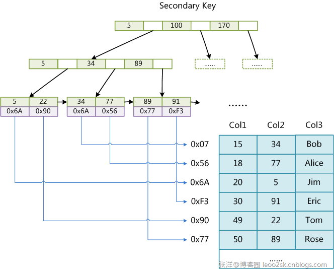
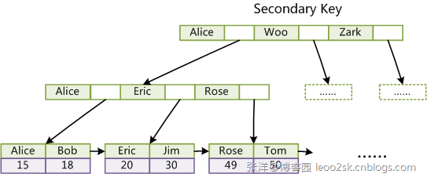

## 索引的本质
MySQL官方对索引的定义为：索引（Index）是帮助MySQL高效获取数据的数据结构。目前大部分数据库系统及文件系统都采用B-Tree或其变种B+Tree作为索引结构

### **B 树**: 平衡树

### **B- 树**: 多路搜索树（并不是二叉的）

   1. 非叶子结点最多只有M个儿子，且M>2；
   2. 根结点的儿子数为[2, M]；
   3. 除根结点以外的非叶子结点的儿子数最少M/2（向上取整）；
   4. 所有叶子结点位于同一层；
   5. 每个结点存放至少M/2-1（向上取整）和至多M-1个关键字；（如下图根节点中25,50,75）
   6. 非叶子结点的关键字：K[1], K[2], …, K[M-1]；且K[i] < K[i+1]；（如下图根节点中25,50,75）
   7. 非叶子结点的指针：P[1], P[2], …, P[M]；（如下图根节点中灰色部分）
   8. 非叶子结点的关键字个数=指向儿子的指针个数-1；

> 四阶B-tree（M=4）

特点：
   1. 关键字集合分布在整颗树中；
   2. 任何一个关键字出现且只出现在一个结点中；
   3. 搜索有可能在非叶子结点结束；
   4. 其搜索性能等价于在关键字全集内做一次二分查找；
   5. 自动层次控制； 

### **B+ 树**：

   
   > 三阶B+tree（M=3）
   
   1. 其定义基本与B-树同，除了：
   2. 非叶子结点的子树指针与关键字个数相同；
   3. 为所有叶子结点增加一个链指针；
   4. 所有关键字都在叶子结点出现；

特性：

   1. 所有关键字都出现在叶子结点的链表中（稠密索引），且链表中的关键字恰好是有序的；
   2. 不可能在非叶子结点命中；
   3. 非叶子结点相当于是叶子结点的索引（稀疏索引），叶子结点相当于是存储（关键字）数据的数据层；
   4. 为所有叶子结点增加一个链指针；
   5. 所有关键字都在叶子结点出现； 
   6. 非叶子结点的子树指针与关键字个数相同
   7. 更适合文件索引系统； 
   

### **B* 树**
   1. B+ 树的变体，在 B+ 树的非根和非叶子结点再增加指向兄弟的指针；
   2. B* 树定义了非叶子结点关键字个数至少为 (2/3)*M ，即块的最低使用率为 2/3 （代替 B+ 树的 1/2 ）；

>   B+ 树的分裂：    
>   当一个结点满时，分配一个新的结点，并将原结点中 1/2 的数据复制到新结点，最后在父结点中增加新结点的指针；  
>   B+ 树的分裂只影响原结点和父结点，而不会影响兄弟结点，所以它不需要指向兄弟的指针；
>
>   B* 树的分裂：  
>   当一个结点满时，如果它的下一个兄弟结点未满，那么将一部分数据移到兄弟结点中，再在原结点插入关键字，
>   最后修改父结点中兄弟结点的关键字（因为兄弟结点的关键字范围改变了）；
>   如果兄弟也满了，则在原结点与兄弟结点之间增加新结点，
>   并各复制 1/3 的数据到新结点，最后在父结点增加新结点的指针；
>   所以， B* 树分配新结点的概率比 B+ 树要低，空间使用率更高； 

## MySQL索引实现
### MyISAM索引实现

默认储存引擎(5.5之前)，每个表对应三个文件：
1. .frm 文件保存表的定义，但是这个文件并不是MyISAM引擎的一部分，而是服务器的一部分；
1. .MYD 保存表的数据；
1. .MYI 是表的索引文件。

主索引

二级索引

#### 优点
1. 高性能读取；
2. 因为它保存了表的行数，当使用COUNT统计时不会扫描全表(包含where条件除外)；

#### 缺点
1. 锁级别为表锁，表锁优点是开销小，加锁快；缺点是锁粒度大，发生锁冲动概率较高，容纳并发能力低，适合查询为主的业务。
2. 此引擎不支持事务，也不支持外键。

### InnoDB索引实现
使用InnoDB时，会将数据表分为.frm(表结构) 和 idb(表数据和索引)两个文件进行存储。 
InnoDB表主键索引是基于聚簇索引建立的，聚簇索引对主键的查询有很高的性能，不过他的二级索引（非主键索引）必须包含主键列。

主键索引

> InnoDB表数据文件本身就是主索引

二级索引

> 索引的key是数据表的主键

### 特点
1. 支持事务处理、ACID事务特性；
2. 实现了SQL标准的四种隔离级别；
3. 支持行级锁和外键约束；
4. 可以利用事务日志进行数据恢复。
5. 锁级别为行锁，行锁优点是适用于高并发的频繁表修改，高并发性能优于 MyISAM。缺点是系统消耗较大。
6. 索引不仅缓存自身，也缓存数据，相比 MyISAM 需要更大的内存。
